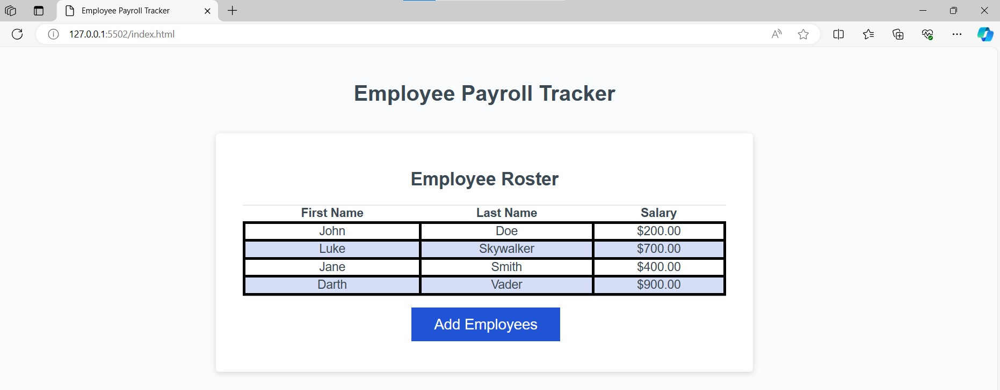
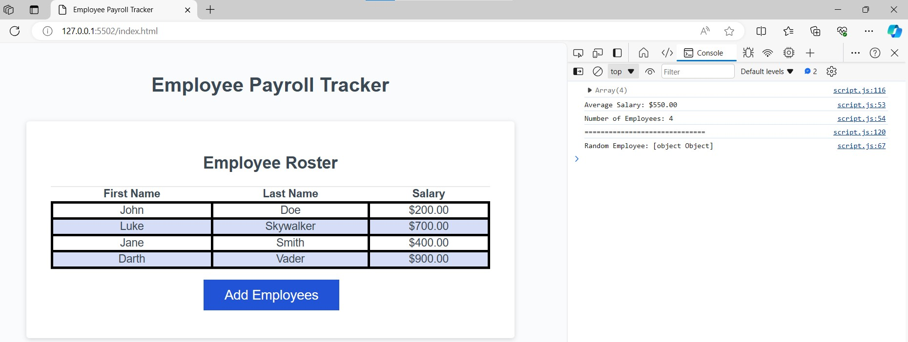

# Employee-Payroll-Tracker

## Employee Payroll Tracker: Week 3 Challenge

## Summary of Task
This week my Challenge required me to modify starter code for an application to enable a payroll manager to view and manage employee payroll data. This app runs in the browser and features dynamically updated HTML and CSS powered by JavaScript code. It has a responsive user interface that adapts to multiple screen sizes.


Below are the following Challenge requirements according to the **User Story** & **Acceptance Criteria**

## User Story

```md
AS A payroll manager
I WANT AN employee payroll tracker
SO THAT I can see my employees' payroll data and properly budget for the company
```

## Acceptance Criteria

```md
GIVEN an employee payroll tracker
WHEN I click the "Add employee" button
THEN I am presented with a series of prompts asking for first name, last name, and salary
WHEN I finish adding an employee
THEN I am prompted to continue or cancel
WHEN I choose to continue
THEN I am prompted to add a new employee
WHEN I choose to cancel
THEN my employee data is displayed on the page sorted alphabetically by last name, and the console shows computed and aggregated data
```
## Meeting Requirements

I was responsible for filling out the following functions:

* 1.  `collectEmployees`: This function allows a user to add multiple employees to display on the page.  The user enters the first name, last name, and salary of each employee, and then have the option to keep adding employees until they choose to stop. 

I used a `while` loop for this, and added an `isNaN` function to help the salary input defaulting to 0 if salary was not entered as a number. 

Accordingly, this function returns an array of objects, specfically the employees' first and last names, and their salary. 


* 2. `displayAverageSalary`: This function takes in the generated array of employees and logs the average salary and number of employees to the console.  I used a template literal string for this task.


* 3. `getRandomEmployee`: This function takes in the generated array of employees, randomly selects one employee, and uses a template literal to log their full name to the console.  I used a built in `Math` object to help with random number generation.  (*note: I was assisted by a TA for this section)

I was provided starter code that includes the `displayEmployees` and `trackEmployeeData` functions. These functions were complete and working. I did not modify any code for the following functions:

* `displayEmployees`: This function takes in an array of employees and renders each employee to an HTML table.

* `trackEmployeeData`: This function executes when the "Add Employees" button is clicked. It takes the array generated in my `collectEmployees` function, sort the employees by last name, and places them on a table on the page using the provided `displayEmployees` function.  Additionally, the function executes the `displayAverageSalary` function to log the average employee salary to the console, and executes the `getRandomEmployee` function to log a random employee's information to the console.

## Deploying to GitHub Pages
Along with the above requirements, I followed the instructions to create this project and deploy it to GitHub Pages. This included creating a new repository, cloning it to my computer, and using git commands to save and push my code to the GitHub repository. 

Finally, I deployed and published my project on the site so that my webpage is live! Hope you enjoyed reviewing my project!


## Project View






## Contact Information
Thanks for visiting!

If you would like to learn more, or contact me, feel free to reach me at the following:

<ul>
    <li>Webpage URL: https://mandrade09.github.io/Employee-Payroll-Tracker/</li>
    <li>GitHub URL: https://github.com/mandrade09/Employee-Payroll-Tracker</li>
    <li>E-mail: mattandrade09@gmail.com</li>
    <li>Phone: 310.903.9150</li>
</ul>

<p>
<footer> &ndash; Matthew Andrade</footer>
</p>
